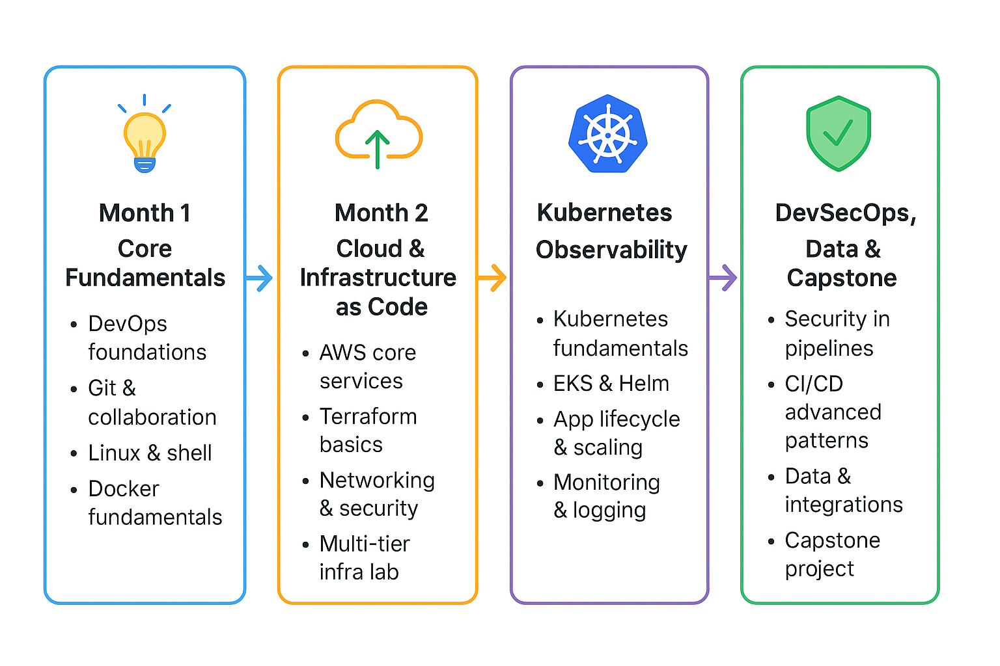

# 🚀 DevOps Training Program — 4-Month Hands-On Journey  

A **project-driven DevOps learning roadmap** that takes you from fundamentals ➜ building ➜ deploying ➜ securing ➜ a production-ready, observable application on **AWS**.  
Focus: *hands-on labs, repeatable workflows, and a guided final capstone.*

---

## 👥 Who This Is For
- 🧑‍💻 Junior Developers, SREs, or Ops Engineers moving into DevOps  
- 👨‍🏫 Teams & instructors wanting ready-to-use training content  
- 🧠 Anyone seeking structured, real-world DevOps practice  

---

## 🎯 Key Learning Outcomes
By the end of this program, you’ll be able to:  
✅ Apply DevOps culture, collaboration, and delivery workflows  
✅ Build CI/CD pipelines using **Jenkins** and **GitHub Actions**  
✅ Containerize applications with **Docker** and **Docker Compose**  
✅ Provision AWS infrastructure using **Terraform**  
✅ Deploy & manage applications on **Kubernetes (EKS)** with **Helm**  
✅ Implement **Monitoring**, **Logging**, and **DevSecOps** checks  
✅ Deliver an **end-to-end Capstone Project**  

---

## 🗓️ 4-Month Roadmap Overview

  

<em>Figure: 4-Month DevOps Training Roadmap</em>

---

### 🌱 Month 1 — Core Fundamentals  
**Goal:** Build strong DevOps foundations  

#### 🧩 Weekend 1: DevOps Foundations  
- DevOps culture, lifecycle, and value  
- Pipeline mapping — identify bottlenecks *(Lab)*  

#### 💾 Weekend 2: Git & Collaboration  
- Git branching, commits, remotes  
- Pull requests, merge conflicts, code reviews *(Lab)*  

#### 🐧 Weekend 3: Linux & Shell  
- Essential Linux commands & file management  
- Bash scripting automation *(Lab)*  

#### 🐳 Weekend 4: Docker Fundamentals  
- Containers, images, registries  
- Writing Dockerfiles & Docker Compose *(Hands-on)*  

---

### ☁️ Month 2 — Cloud & Infrastructure as Code  
**Goal:** Learn AWS + Terraform for repeatable infrastructure  

#### ☁️ Weekend 1: AWS Core Services  
- VPC, EC2, IAM basics  
- S3, RDS, and storage patterns *(Lab)*  

#### 🌍 Weekend 2: Terraform Basics  
- Providers, resources, state  
- Writing modules & structuring code *(Lab)*  

#### 🔐 Weekend 3: Networking & Security  
- VPC design, subnets, security groups  
- Secrets management & IAM policies *(Lab)*  

#### 🧱 Weekend 4: Multi-Tier Infrastructure Lab  
- Combine Terraform modules into a full application infrastructure  
- Terraform plan, validation & review workflow  

---

### ☸️ Month 3 — Kubernetes & Observability  
**Goal:** Learn container orchestration, scaling, and monitoring  

#### ⚙️ Weekend 1: Kubernetes Fundamentals  
- Kubernetes architecture, objects, and controllers  
- Deployments, Services, ConfigMaps, Secrets *(Lab)*  

#### 🧩 Weekend 2: EKS & Helm  
- Provision **EKS** or local cluster alternatives  
- Helm charts & release management *(Lab)*  

#### 🚀 Weekend 3: Application Lifecycle & Scaling  
- Rolling updates, probes, autoscaling  
- Blue/green & canary deployments *(Lab)*  

#### 📊 Weekend 4: Monitoring & Logging  
- Prometheus metrics & Grafana dashboards  
- Centralized logging (Fluentd / ELK) & alerting *(Lab)*  

---

### 🔒 Month 4 — DevSecOps, Data & Capstone  
**Goal:** Secure pipelines, automate delivery, and complete the final project  

#### 🛡️ Weekend 1: Security in Pipelines  
- SAST/DAST, dependency & secrets scanning  
- Pipeline hardening & policy enforcement *(Lab)*  

#### 🔁 Weekend 2: Advanced CI/CD Patterns  
- GitOps, multi-environment pipelines, rollback strategies  
- Build caching & artifact management *(Lab)*  

#### 🧮 Weekend 3: Data & Integrations  
- Data platform overview (AWS/GCP/Databricks)  
- Integrating data workflows *(Lab)*  

#### 🏁 Weekend 4: Capstone Sprint & Demo  
- Integrate **Code → CI/CD → Infrastructure → EKS → Monitoring**  
- Final demo, evaluation, and post-mortem  

---

## 🧭 Weekend / Class Format
⏱️ **2-Hour Concept Session** → 🔧 **20-Min Hands-On Lab** → 🧩 **Mini Checkpoint**  
Each session concludes with a *practical takeaway or small automation script.*

---

## 🏆 Final Capstone Project
A guided, end-to-end DevOps delivery pipeline with deliverables:  
- 🧱 Architecture diagrams  
- ⚙️ Deployment artifacts  
- 📋 Assessment rubric & presentation  

---

> 💡 *"Build it. Break it. Fix it. Automate it."*  
> That’s how real DevOps engineers grow 🚀
